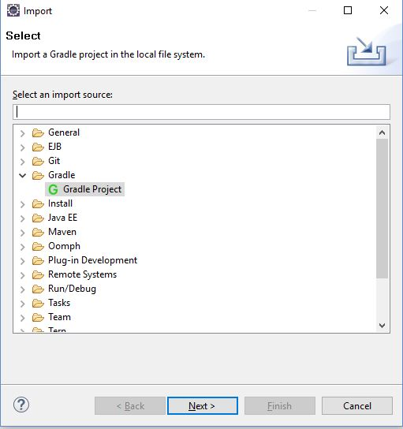
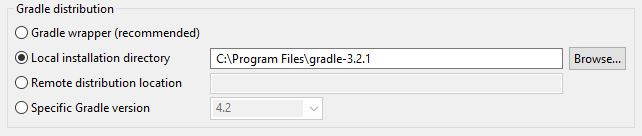
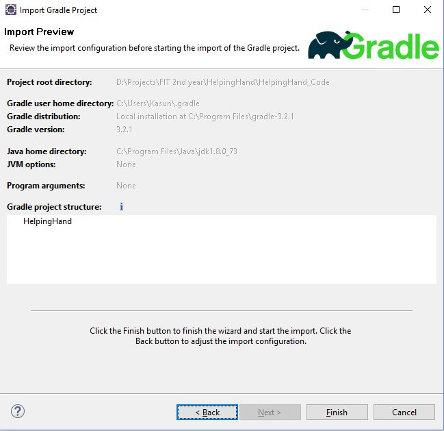
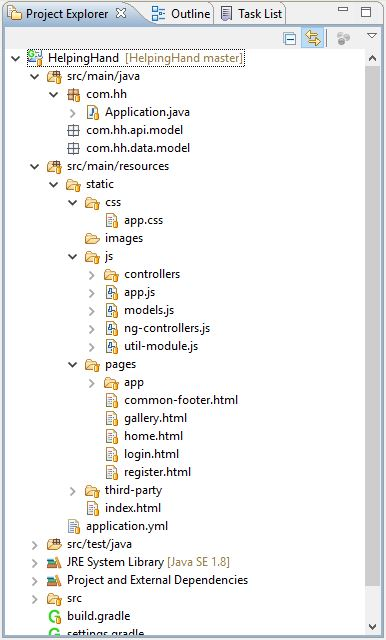
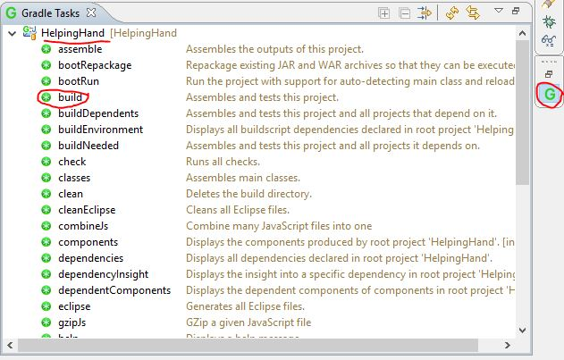

# HelpingHand
### Code base overview and code workthrough
<hr/>

> **Note:** Use 'Testing Work' folder to checkout your all testing work. Do not use code base unless for actual code development.
**Code Base : _'HelpingHand_Code'_ folder**

<hr/>
<br/>

### Setting up code base in eclipse
##### Pre Requisites
* [Install JDK 8](https://www3.ntu.edu.sg/home/ehchua/programming/howto/JDK_Howto.html)
* [Install Gradle](https://www.tutorialspoint.com/gradle/gradle_installation.htm)
* [Install Eclipse](https://www.eclipse.org/downloads/?)

##### Steps
1. Pull latest code base into local machine ```git pull origin master```
You will have a _HelpingHand_Code_ folder in it. That is the project.
2. Open the eclipse. Select eclipse workspace as _'HealpingHand'_ folder.
3. Goto ```Help > Eclipse Marketplace```, search for **Buildship GradleIntegration** and install. (You amy want to restart the eclipse)
4. Goto ```File > Import```, select **gradle project** from the list, and **Next** 

5. Select **Project root directory** as **\[path to project\]\HelpingHand\HelpingHand_Code**, and Next
6. Tick on **Local installation directory** in _Gradle distribution_ and give _\[gradle home path\]_, and **Next** 

7. Make sure you have project added in 'Gradle project structure', then **Finish** 


<br/>

### Project Structure
After setting up the code base in eclipse you will see following project structure in the 'Project Explorer'


**build.gradle** is responsible for building the project with dependancies. To build the project Click on gradle task tool and expand 'HelpingHand', then double click on 'build'. If you can't see the gradle tasks tool, goto ```Window > Show View > Other... > Gradle > Gradle Tasks```


**Application.java** is the starting point of the application. You can right click on **Application.java** and click ```Run As > Java Application```, and the Application will start and open the web page in your default browser.

> **Note :** 'ng-controllers.js' is an auto generated file when you run the gradle build. It contains all the controller js files written in ```js > controllers``` folder. So you may only modify or add angular controllers in 'controller' folder and then run gradle build. It will do the rest.

**See 'app.js' for how URL patterns are and how html templates should be.**
